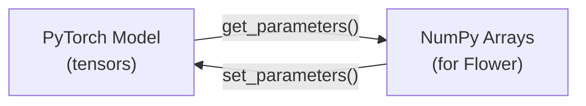

# Utilities

`src/utils.py`

Helper functions to convert between PyTorch model parameters and NumPy arrays. This bridge is necessary because Flower transmits parameters as NumPy arrays over the network, while PyTorch stores them as tensors.



---

## `get_parameters()`

```python
def get_parameters(model) -> List[np.ndarray]
```

Extract all trainable parameters from a PyTorch model as a list of NumPy arrays.

| Parameter | Type | Description |
|-----------|------|-------------|
| `model` | `nn.Module` | Any PyTorch model |

**Returns**: `List[np.ndarray]` — One array per parameter tensor in the model's `state_dict`.

### What it returns for HeartDiseaseNet

| Index | Shape | Description |
|:-----:|-------|-------------|
| 0 | `(64, 13)` | Layer 1 weights |
| 1 | `(64,)` | Layer 1 biases |
| 2 | `(32, 64)` | Layer 2 weights |
| 3 | `(32,)` | Layer 2 biases |
| 4 | `(1, 32)` | Layer 3 weights |
| 5 | `(1,)` | Layer 3 bias |

### Example

```python
from fl_core.model import HeartDiseaseNet
from fl_core.utils import get_parameters

model = HeartDiseaseNet()
params = get_parameters(model)

print(len(params))           # 6
print(params[0].shape)       # (64, 13)
print(type(params[0]))       # <class 'numpy.ndarray'>
```

---

## `set_parameters()`

```python
def set_parameters(model, parameters) -> None
```

Load parameters from NumPy arrays into a PyTorch model. Overwrites all existing weights.

| Parameter | Type | Description |
|-----------|------|-------------|
| `model` | `nn.Module` | Target PyTorch model |
| `parameters` | `List[np.ndarray]` | Parameters to load (must match model architecture) |

**Returns**: `None` — modifies the model in-place.

### Example

```python
from fl_core.model import HeartDiseaseNet
from fl_core.utils import get_parameters, set_parameters

model_a = HeartDiseaseNet()
model_b = HeartDiseaseNet()

# Copy weights from model_a to model_b
params = get_parameters(model_a)
set_parameters(model_b, params)
```

!!! warning "Shape mismatch"
    The number and shapes of arrays in `parameters` must exactly match the model's `state_dict()`. Passing mismatched parameters will raise a `RuntimeError`.

### Implementation detail

```python
def set_parameters(model, parameters):
    params_dict = zip(model.state_dict().keys(), parameters)
    state_dict = OrderedDict({k: torch.tensor(v) for k, v in params_dict})
    model.load_state_dict(state_dict, strict=True)  # strict=True ensures exact match
```

The `strict=True` flag ensures every parameter in the model is accounted for — no missing or extra keys are allowed. This prevents subtle bugs where a partially-loaded model silently produces incorrect results.
