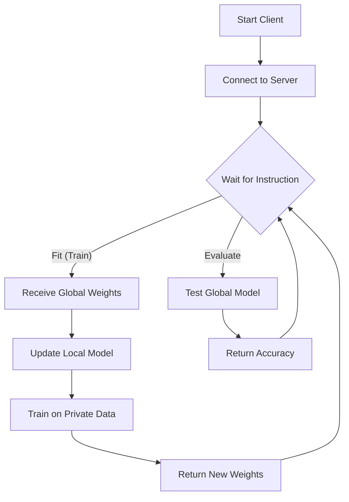

# FL Client Guide

This document explains the logic within `src/fl_core/client.py`. The Client represents a **Hospital**.

## Client Logic Flowchart

## Detailed Breakdown

### 1. The Class (`HeartDiseaseClient`)
This class inherits from `fl.client.NumPyClient`. This is the standard way to define a Flower client.
It holds:
-   `self.trainloader`: The private data for this hospital.
-   `self.model`: The local copy of the neural network.

### 2. The `fit()` Method (Training)
This is the heart of the client. It runs when the server says "Train!".

1.  **set_parameters**: It overwrites its local model with the weights sent by the server. This ensures it starts from the global knowledge.
2.  **train_model**: It runs a standard PyTorch training loop (Forward pass -> Loss -> Backward pass -> Optimizer step).
    -   *Crucial*: It uses `self.trainloader`, which contains **local, private data**.
3.  **return**: It sends back `get_parameters(self.model)`.
    -   *Privacy Check*: It sends **weights**, not data.

### 3. The `evaluate()` Method (Testing)
This runs when the server says "Test yourself!".

1.  **set_parameters**: Again, it updates its model to match the server's current best.
2.  **test_model**: It runs the model on `self.testloader` (unseen local data).
3.  **return**: It sends back the `loss` and `accuracy` (e.g., "I achieved 85% accuracy").

### 4. `start_client`
This function is the entry point. It simply creates the `HeartDiseaseClient` and tells Flower to connect to the server address (default `127.0.0.1:8080`).

## Key Takeaway
The Client is "dumb" but **secure**. It does exactly what the server asks (Train or Test), but it performs those actions strictly on its own private data vault. It never leaks a single patient record.
