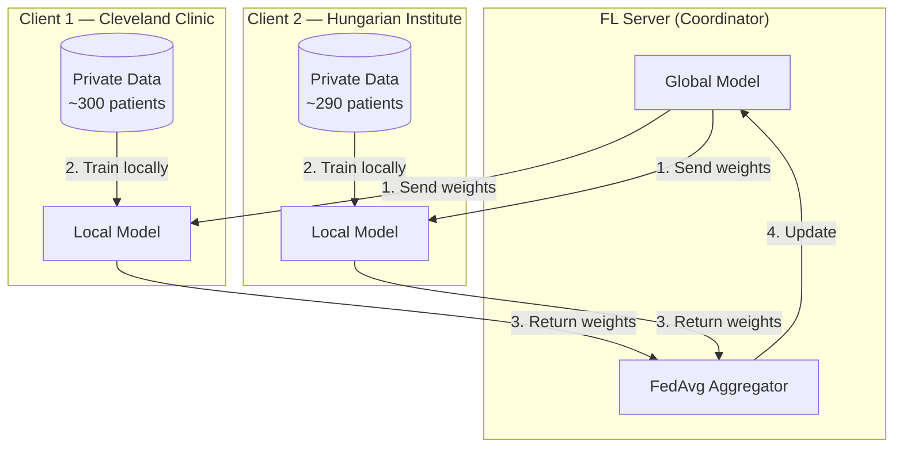
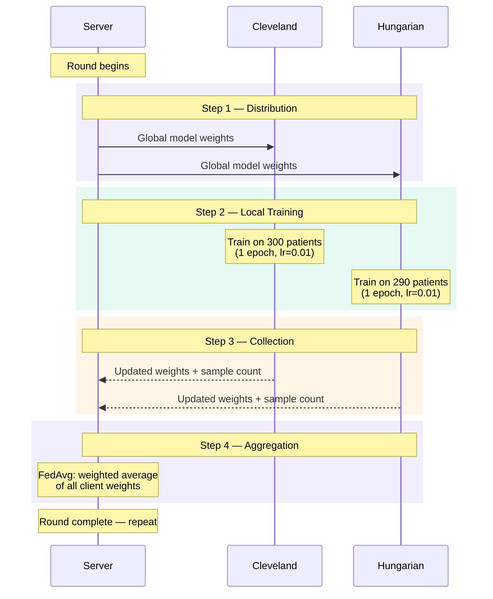

# How Federated Learning Works

!!! tip "You will learn"
    - The three core components: Server, Clients, and Model
    - How the training loop works across multiple hospitals
    - Why this architecture preserves patient privacy
    - How our implementation maps to these concepts

## The Core Idea

Traditional machine learning requires **all data in one place**. You collect patient records from every hospital, merge them into a single dataset, and train a model.

Federated Learning flips this. Instead of moving data to the model, we **move the model to the data**.

> The model travels to each hospital, learns from local data, and returns — carrying knowledge but no patient records.

## System Architecture

Our system has three components that work together:

### The Server

The server is the **coordinator** — it never sees patient data. Its responsibilities:

- **Manage the global model** — the shared neural network that improves each round
- **Distribute weights** — send the current model parameters to each hospital
- **Aggregate updates** — combine the weight updates from all hospitals using FedAvg

In our code, this is [`src/server.py`](../api/server.md).

### The Clients

Each client represents a **hospital**. A client:

- **Holds private data** — its own patient records that never leave the premises
- **Trains locally** — updates the model using only its own patients
- **Reports back** — sends model weights (mathematical parameters) to the server

In our code, this is [`src/client.py`](../api/client.md).

### The Model

A shared neural network architecture that all parties agree on:

- **Input**: 13 medical features (age, blood pressure, cholesterol, etc.)
- **Output**: Probability of heart disease (0 to 1)
- **Same architecture everywhere** — each hospital uses an identical network structure

In our code, this is [`src/model.py`](../api/model.md).

## The Training Loop

Federated Learning operates in **rounds**. Each round follows a precise sequence:

### Step by step

| Step | What happens | What travels over the network |
|------|-------------|------------------------------|
| **Distribution** | Server sends global model to all clients | Model weights (numbers) |
| **Local Training** | Each client trains the model on private data | Nothing — training is local |
| **Collection** | Clients send updated weights back to server | Model weights + sample count |
| **Aggregation** | Server averages all weights using FedAvg | Nothing — computation is local |

!!! warning "Critical point"
    Notice that **patient data never appears** in the "What travels" column. Only mathematical parameters (model weights) cross the network boundary.

## How It Maps to Our Code

Here's how the abstract architecture maps to concrete files:

| Concept | File | Key function |
|---------|------|-------------|
| Server orchestration | `src/server.py` | `start_server()` |
| FedAvg strategy | `src/server.py` | `weighted_average()` |
| Client (hospital) | `src/client.py` | `HeartDiseaseClient` class |
| Local training | `src/model.py` | `train_model()` |
| Model definition | `src/model.py` | `HeartDiseaseNet` class |
| Data loading | `src/data_loader.py` | `load_hospital_data()` |
| Weight conversion | `src/utils.py` | `get_parameters()` / `set_parameters()` |
| Full simulation | `run_simulation.py` | `run_simulation()` |

??? example "Deep Dive — Why not just merge the data?"
    You might ask: if the goal is a better model, why not just combine all hospitals' data into one big dataset?

    Three reasons:

    1. **Legal barriers** — Privacy laws (HIPAA, GDPR) prohibit sharing patient records across institutions without explicit consent from every patient.

    2. **Trust barriers** — Hospitals are competitors. They have little incentive to hand over valuable patient data to a central authority.

    3. **Technical barriers** — Patient datasets can be enormous. Transferring terabytes of medical imaging data is slow, expensive, and creates security risks.

    Federated Learning sidesteps all three: the data stays put, the law is satisfied, trust isn't required, and only kilobytes of model weights travel the network.

## Next Steps

[**The FedAvg Algorithm** :material-arrow-right:](federated-averaging.md)

Dive into the math behind how weights are averaged across hospitals.

