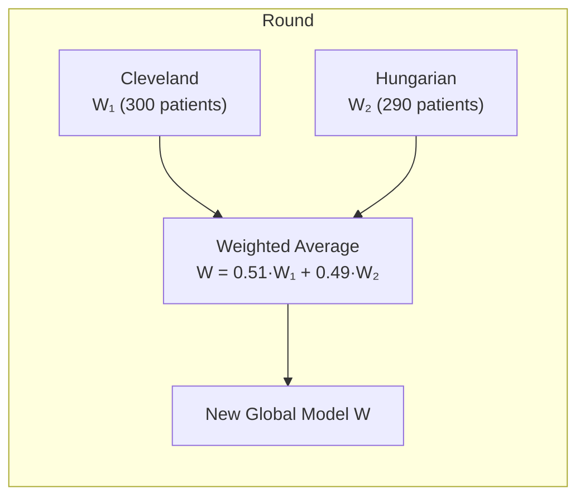

# The FedAvg Algorithm

!!! tip "You will learn"
    - What Federated Averaging (FedAvg) does and why it works
    - The mathematical formula behind weight aggregation
    - How hospitals with different dataset sizes are handled fairly
    - How this is implemented in our codebase

## What is FedAvg?

**Federated Averaging** (FedAvg) is the aggregation algorithm that combines model updates from multiple clients into a single improved global model. It was introduced by McMahan et al. (2017)[^1] and remains the most widely used federated aggregation strategy.

[^1]: McMahan, B., et al. "Communication-Efficient Learning of Deep Networks from Decentralized Data." AISTATS 2017.

Think of it as a **democratic vote, weighted by experience**:

- A hospital with 300 patients has "seen more" than one with 100
- Its updates should count proportionally more
- FedAvg achieves exactly this through a weighted average

## The Algorithm

Each round of FedAvg follows four steps:

```
1. Server sends global model W to all clients
2. Each client k trains locally → produces updated weights W_k
3. Each client reports W_k and its sample count n_k
4. Server computes new global model:

   W_new = Σ (n_k / n_total) × W_k
```

### In plain English

The server takes each hospital's updated model and averages them — but hospitals with more patients get more influence. If Cleveland has 300 patients and Hungarian has 290, Cleveland's contribution is weighted slightly higher (300/590 vs 290/590).

### Visual walkthrough



## The Math

Given `K` clients where client `k` has `n_k` data samples:

$$
W_{global} = \sum_{k=1}^{K} \frac{n_k}{\sum_{j=1}^{K} n_j} \cdot W_k
$$

For our two-hospital system:

| Hospital | Patients (n_k) | Weight (n_k / total) |
|----------|:--------------:|:-------------------:|
| Cleveland | 300 | 300/590 = **0.508** |
| Hungarian | 290 | 290/590 = **0.492** |

The weights are almost equal because both hospitals have similar dataset sizes. If one hospital had significantly more data, its contribution would dominate — which is the correct behavior, since more data means more reliable updates.

## Implementation

Our FedAvg implementation lives in `src/server.py`. Here's the key function:

```python
def weighted_average(metrics: List[Tuple[int, Metrics]]) -> Metrics:
    """Aggregate metrics using weighted average."""
    total_examples = sum(num_examples for num_examples, _ in metrics)
    accuracies = [num_examples * m["accuracy"] for num_examples, m in metrics]
    weighted_accuracy = sum(accuracies) / total_examples
    return {"accuracy": weighted_accuracy}
```

!!! info "Note"
    The actual weight aggregation (averaging the model parameters) is handled internally by Flower's `FedAvg` strategy class. Our `weighted_average` function handles **metric** aggregation — computing the overall accuracy as a weighted average of per-client accuracies.

The strategy configuration:

```python
strategy = fl.server.strategy.FedAvg(
    fraction_fit=1.0,           # Use 100% of clients each round
    fraction_evaluate=1.0,      # Evaluate on 100% of clients
    min_fit_clients=2,          # Wait for both hospitals
    min_evaluate_clients=2,
    min_available_clients=2,
    evaluate_metrics_aggregation_fn=weighted_average,  # Our custom aggregator
)
```

### Configuration parameters

| Parameter | Value | Meaning |
|-----------|:-----:|---------|
| `fraction_fit` | 1.0 | Sample 100% of available clients for training |
| `fraction_evaluate` | 1.0 | Sample 100% of clients for evaluation |
| `min_fit_clients` | 2 | Don't start a round until both hospitals are ready |
| `on_fit_config_fn` | `epochs=1, lr=0.01` | Each client trains for 1 epoch at learning rate 0.01 |

??? example "Deep Dive — Why weighted average instead of simple average?"
    A simple (unweighted) average treats every hospital equally regardless of dataset size. This sounds fair, but it's statistically suboptimal.

    **Example**: Hospital A has 1,000 patients and learns a reliable pattern. Hospital B has 10 patients and learns a noisy, unreliable pattern.

    - **Simple average**: Both contribute 50%. Hospital B's noise corrupts the model.
    - **Weighted average**: Hospital A contributes 99%. The reliable signal dominates.

    In our case, both hospitals are similar in size (300 vs 290), so the difference is small. But the weighted approach is correct in general and costs nothing extra.

## How Rounds Improve the Model

Across multiple rounds, the model progressively improves:

| Round | What happens |
|:-----:|-------------|
| **1** | Model starts with random weights. Both hospitals train. First aggregation captures initial patterns. |
| **2** | Model starts from Round 1 knowledge. Hospitals refine it. Aggregation strengthens shared patterns. |
| **3** | Model has seen all hospitals' patterns twice. Aggregation produces a robust final model. |

Each round builds on the previous one. The global model acts as a **knowledge accumulator** — it carries the combined learning from all hospitals across all rounds.

## Next Steps

<div class="fl-link-card" markdown>

[**Privacy & Security** :material-arrow-right:](privacy.md)

Understand exactly what data is exposed and why this approach is compliant with privacy regulations.

</div>
