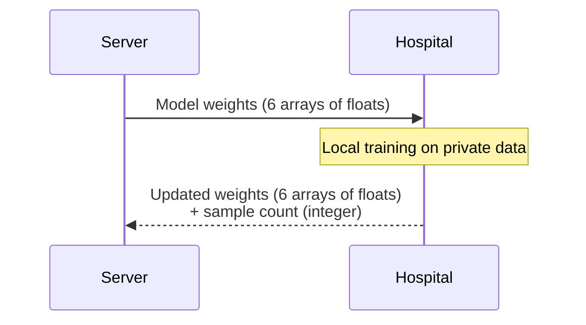

# Privacy & Security

!!! tip "You will learn"
    - Exactly what data crosses the network boundary
    - Why model weights don't reveal patient information
    - How this approach satisfies HIPAA and GDPR
    - Known limitations and potential attack vectors

## The Privacy Guarantee

The fundamental privacy guarantee of Federated Learning is simple:

> **Raw patient data never leaves the hospital.**

Every computation involving patient records — feature extraction, normalization, gradient computation, loss calculation — happens **locally** on the hospital's own infrastructure. The only thing transmitted is the resulting model weights: a list of floating-point numbers that represent learned patterns, not individual patients.

## What Actually Travels

Let's trace exactly what crosses the network during one round:



### The data that is transmitted

| Direction | Data | Format | Size |
|-----------|------|--------|------|
| Server → Client | 6 weight arrays | NumPy float32 arrays | ~10 KB |
| Client → Server | 6 weight arrays | NumPy float32 arrays | ~10 KB |
| Client → Server | Sample count | Single integer | 8 bytes |
| Client → Server | Loss, accuracy | Two floats | 16 bytes |

### The data that stays local

| Data | Location | Never transmitted |
|------|----------|:-:|
| Patient names, IDs | Hospital | :material-check: |
| Age, sex, blood pressure | Hospital | :material-check: |
| Cholesterol, ECG results | Hospital | :material-check: |
| Heart disease diagnosis | Hospital | :material-check: |
| Raw CSV files | Hospital | :material-check: |
| Training gradients | Hospital | :material-check: |
| Intermediate computations | Hospital | :material-check: |

!!! warning "Important distinction"
    Model weights are **aggregate statistical patterns**, not patient records. A weight value like `0.3472` tells you nothing about any individual patient — it's a learned parameter that encodes a relationship between features across hundreds of patients.

## Regulatory Compliance

### HIPAA (United States)

HIPAA's Privacy Rule protects **individually identifiable health information** (PHI). In our system:

- No PHI is transmitted — only model parameters
- No patient records leave the hospital's network
- The server never has access to any patient data
- Each hospital maintains full control over its data

### GDPR (European Union)

GDPR requires a **lawful basis** for processing personal data and restricts cross-border data transfers. Federated Learning addresses this by:

- **Data minimization** — only model weights are shared, not personal data
- **Purpose limitation** — local data is used only for local training
- **No data transfer** — patient data stays within the institution's jurisdiction

## Model Weight Structure

To understand why weights don't reveal patient data, look at what our model's weights actually are:

```python
# Our model has 6 parameter arrays:
Layer 1: weights (13 × 64 matrix)  + biases (64 values)
Layer 2: weights (64 × 32 matrix)  + biases (32 values)
Layer 3: weights (32 × 1 matrix)   + biases (1 value)

# Total: 3,169 floating-point numbers
# Example values: [0.0234, -0.1892, 0.4721, ...]
```

These 3,169 numbers encode **generalized patterns** like "higher cholesterol combined with older age increases heart disease risk." They don't encode "Patient John Smith, age 67, has heart disease."

??? example "Deep Dive — Can weights be reverse-engineered?"
    This is an active area of research. Some known attack vectors:

    **Model inversion attacks** attempt to reconstruct training data from model updates. In practice, these attacks:

    - Work best with very small datasets
    - Produce blurry, statistical reconstructions — not individual records
    - Are significantly harder with aggregated weights from multiple clients
    - Can be mitigated with differential privacy (adding controlled noise)

    **Gradient leakage attacks** try to recover training samples from gradient updates. Defenses include:

    - **Secure aggregation** — the server only sees the aggregated result, not individual updates
    - **Differential privacy** — adding calibrated noise to updates before transmission
    - **Gradient compression** — transmitting only the most significant gradient updates

    Our current implementation provides **basic FL privacy** (data stays local). Production systems would add these additional defense layers.

## Privacy Threat Model

| Threat | Protected? | How |
|--------|:----------:|-----|
| Direct data breach (server hacked) | :material-check: | Server never has patient data |
| Network eavesdropping | :material-check: | Only weights on the wire, not records |
| Curious server operator | :material-check: | Server receives weights, not data |
| Model inversion attack | :material-alert: | Basic protection; add differential privacy for stronger guarantees |
| Gradient leakage | :material-alert: | Basic protection; add secure aggregation for stronger guarantees |
| Client compromise | :material-close: | If a hospital is breached, its local data is exposed (same as any system) |

!!! info "Note"
    The :material-alert: items represent **theoretical** attack vectors that require significant expertise and specific conditions. For most practical threat models, Federated Learning provides strong privacy guarantees.

## Summary

Federated Learning doesn't just *reduce* data sharing — it **eliminates** it. The mathematical model weights that travel the network encode population-level patterns, not individual patient information. This architectural guarantee is what makes FL suitable for privacy-sensitive domains like healthcare.
