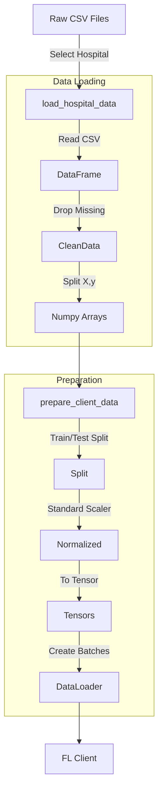

# Data Loading Process Explained

This document explains exactly how the `src/fl_core/data_loader.py` file prepares your heart disease data for Federated Learning.

## Overview Flowchart

The data pipeline has three main stages:
1.  **Selection**: Picking the specific hospital.
2.  **Processing**: Cleaning and formatting the raw CSV.
3.  **Preparation**: Splitting into Train/Test and converting to PyTorch tensors.

## Detailed Breakdown

### 1. Loading Raw Data (`load_hospital_data`)
This function (lines 20-40) is responsible for reading the specific file for a single hospital.

-   **Input**: `hospital_name` (e.g., 'cleveland')
-   **File Mapping**: It looks up the correct filename:
    -   Cleveland -> `processed.cleveland.data`
    -   Hungarian -> `processed.hungarian.data`
-   **Cleaning**:
    -   It reads the CSV using pandas.
    -   It replaces `?` (missing values) with `NaN`.
    -   It creates a binary target: `1` if they have heart disease (`num > 0`), `0` otherwise.
    -   **Important**: It fills remaining missing values with the **mean** of that column.

### 2. Loading All Supported Hospitals (`load_all_hospitals`)
This function (lines 43-64) loops through the list of supported hospitals (`['cleveland', 'hungarian']`) and calls the previous function for each. It returns a list of tuples: `(name, X, y)`.

### 3. Preparing for PyTorch (`prepare_client_data`)
This function (lines 67-88) takes the raw numpy arrays (`X`, `y`) and converts them into something the AI model can learn from.

1.  **Train/Test Split**: It sets aside 20% of the data for testing (`test_size=0.2`).
2.  **StandardScaler**:
    -   Deep learning models learn better when all inputs are roughly the same scale (e.g., between -1 and 1).
    -   We fit the scaler on the *training* data and apply it to both.
3.  **Tensor Conversion**:
    -   Converts numpy arrays to `torch.FloatTensor` (numbers) and `torch.LongTensor` (labels).
    -   `unsqueeze(1)` is used on labels to change their shape from `[batch_size]` to `[batch_size, 1]` so they match the network output.
4.  **DataLoader**:
    -   Wraps the tensors in a `DataLoader`.
    -   This handles **batching** (serving 32 patients at a time) and **shuffling** (randomizing order for better training).

## Key Takeaway
The most important concept here is that **each hospital's data is processed independently**. The `StandardScaler` at Cleveland only sees Cleveland data. This preserves privacy and simulates the real-world scenario where hospitals cannot share their raw stats to calculate a "global" mean.
