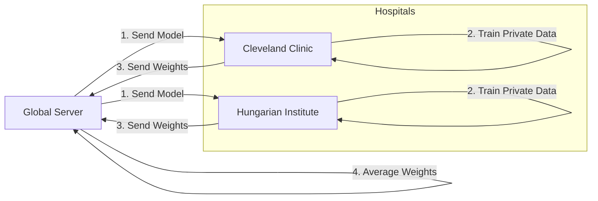

# Final Project Summary: Heart Disease Federated Learning

## 🎯 What We Built
We implemented a **Federated Learning (FL) System** that allows two hospitals (**Cleveland Clinic** and **Hungarian Institute**) to collaboratively train an AI model to predict heart disease without ever sharing their patient records.

This project demonstrates **Privacy-Preserving AI**: The model travels, but the data stays put.

---

## 🏗 System Architecture

The system consists of three main moving parts:

### 1. The Global Server (Conductor)
-   **Role**: Coordinates the training.
-   **Logic**: It sends the current model to hospitals, waits for their updates, and averages them to create a better model.
-   **Algorithm**: Uses `FedAvg` (Federated Averaging).

### 2. The Clients (Hospitals)
-   **Role**: Train locally on private data.
-   **Cleveland Hospital**: ~300 Patients.
-   **Hungarian Hospital**: ~290 Patients.
-   **Privacy**: They never send data to the server, only model **weights** (mathematical parameters).

### 3. The Model (Brain)
-   **Type**: A simple Neural Network (PyTorch).
-   **Input**: 13 medical features (Age, Blood Pressure, Cholesterol, etc.).
-   **Output**: Probability of Heart Disease (0-1).

---

## 🔧 Technical Deep Dive: PyTorch & Flower

This project combines **Flower** (for networking) with **PyTorch** (for efficient math).

### Why PyTorch?
We use PyTorch because it allows us to define the neural network as a computation graph.

-   **`nn.Module`**: Our `HeartDiseaseNet` inherits from this. It defines the layers (Linear, ReLU) and the "Forward Pass" (how data flows).
-   **`DataLoader`**: This PyTorch utility handles the messy parts of data: shuffling 300 patients, splitting them into batches of 32, and feeding them to the GPU/CPU efficiently.
-   **`Backward Pass`**: This is how the model learns. It calculates the "Loss" (error margin) and calculates gradients (directions to adjust weights) to minimize that error.

### The Flower Bridge
Flower doesn't know PyTorch exists. It only cares about **NumPy Arrays** (lists of numbers).
-   **`get_parameters`**: We convert PyTorch's internal state -> NumPy list.
-   **`set_parameters`**: We convert the Global NumPy list -> PyTorch's internal state.

---

## 🔄 The Workflow (How it Runs)

We created a simulation script (`simulation.py`) that automates the entire process in one click.

---

## 🚀 Final Result

When you run `python simulation.py`, the following happens:

1.  **Data Loading**: The system securely loads the separated data for Cleveland and Hungarian hospitals.
2.  **Initialization**: The Server starts and the two clients connect.
3.  **Training Rounds (3 Rounds)**:
    -   **Round 1**: The model starts with random knowledge. Clients train.
    -   **Round 2**: The Server updates the model with knowledge from Round 1. Clients refine it.
    -   **Round 3**: The model becomes "smart," having learned patterns from both hospitals.

### Success Metrics
-   **Privacy Preserved**: 0 patient records were transferred.
-   **Collaboration**: Both hospitals contributed to the final model.
-   **Simplicity**: The entire complex interaction runs in a single process for easy demonstration.

---

## 📂 Documentation Map

We have created detailed guides for every part of the system if you want to dive deeper:

-   [**Project Overview**](project_overview.md): High-level explanation of FL.
-   [**Data Loading Guide**](data_loading_guide.md): How raw CSVs become PyTorch Tensors.
-   [**Server Guide**](server_guide.md): Deep dive into the `FedAvg` strategy.
-   [**Client Guide**](client_guide.md): How the local training loop works.

---

## ✅ Conclusion
You now have a fully functional Federated Learning simulation. It is a simplified but architecturally correct representation of how real-world medical AI systems are built today.
