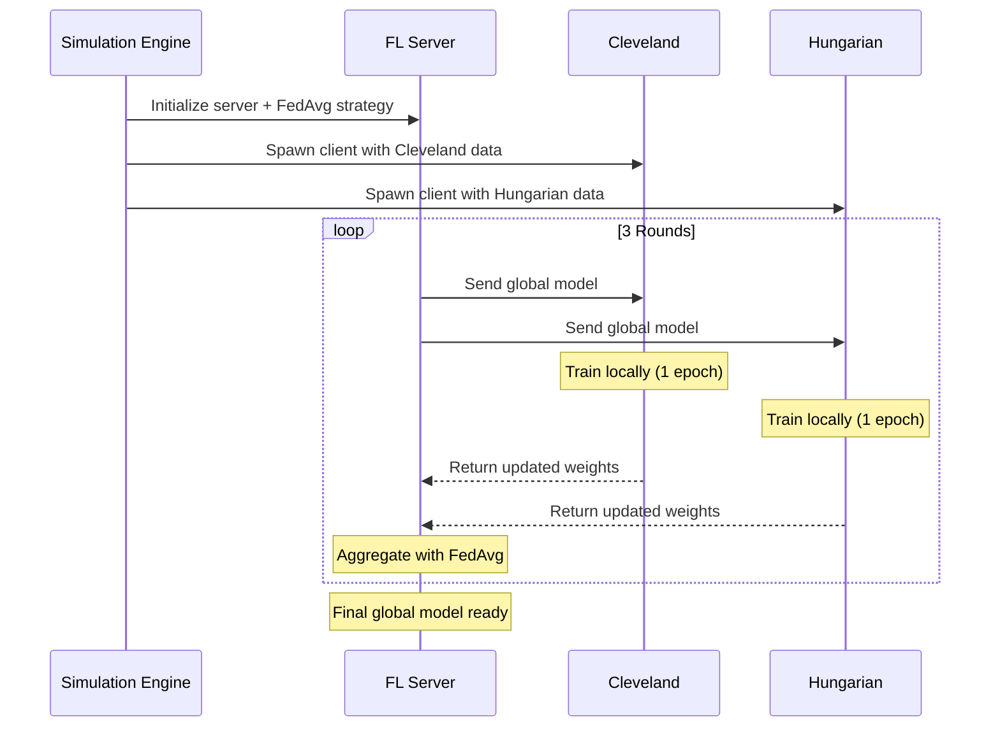

# Getting Started

!!! tip "You will learn"
    - How to install the FL framework and its dependencies
    - How to download the heart disease dataset
    - How to run your first federated simulation
    - What happens during a training run

## Prerequisites

You need **Python 3.9+** installed on your machine. Verify with:

```bash
python3 --version  # Should print 3.9 or higher
```

## Installation

### 1. Clone the repository

```bash
git clone https://github.com/abdifatah/fl-thesis-project.git
cd fl-thesis-project
```

### 2. Create a virtual environment

=== "macOS / Linux"

    ```bash
    python3 -m venv venv
    source venv/bin/activate
    ```

=== "Windows"

    ```bash
    python -m venv venv
    venv\Scripts\activate
    ```

### 3. Install the package

```bash
pip install -e .
```

This installs the core framework along with all dependencies:

| Package | Purpose |
|---------|---------|
| `flwr` | Flower — Federated Learning framework |
| `torch` | PyTorch — Neural network training |
| `pandas` | Data manipulation |
| `scikit-learn` | Preprocessing (StandardScaler, train/test split) |
| `numpy` | Numerical computing |

## Download the Dataset

The project uses the **UCI Heart Disease** dataset — a well-known benchmark containing patient records from multiple hospitals.

```bash
python scripts/download_data.py
```

This creates `data/heart_disease/raw/` with separate files for each hospital:

```
data/heart_disease/raw/
├── processed.cleveland.data    # ~300 patients
└── processed.hungarian.data    # ~290 patients
```

!!! info "Why separate files?"
    Each file represents a **different hospital's data**. In Federated Learning, these files are never combined — each client (hospital) only accesses its own file. This simulates real-world data silos.

## Run Your First Simulation

```bash
python run_simulation.py
```

That's it. This single command orchestrates the entire federated system:



### What you'll see

The simulation runs **3 rounds** of federated training. In each round:

1. The server sends the current global model to both hospitals
2. Each hospital trains the model on its **private** data for 1 epoch
3. Each hospital sends back **only the model weights** (not data)
4. The server averages the weights using FedAvg

!!! tip "Key insight"
    Watch the accuracy improve across rounds — the model gets smarter by learning from both hospitals, even though neither hospital shared a single patient record.

## Project Structure

```
fl-thesis-project/
├── src/                        # Core framework
│   ├── model.py                # HeartDiseaseNet neural network
│   ├── client.py               # Flower client (hospital)
│   ├── server.py               # FL server + FedAvg strategy
│   ├── data_loader.py          # Data loading & preprocessing
│   └── utils.py                # PyTorch ↔ NumPy conversion
├── scripts/
│   ├── download_data.py        # Dataset downloader
│   └── run_client.py           # Standalone client launcher
├── run_simulation.py           # Main entry point
└── pyproject.toml              # Dependencies & config
```

## Next Steps

Now that you have a running simulation, explore the concepts behind it:

<div class="fl-link-card" markdown>
[**How Federated Learning Works** :material-arrow-right:](concepts/architecture.md)

Understand the architecture — server, clients, and the training loop.
</div>

<div class="fl-link-card" markdown>
[**The FedAvg Algorithm** :material-arrow-right:](concepts/federated-averaging.md)

Learn how model weights are aggregated across hospitals.
</div>

<div class="fl-link-card" markdown>
[**Privacy & Security** :material-arrow-right:](concepts/privacy.md)

Why this approach satisfies HIPAA and GDPR requirements.
</div>
