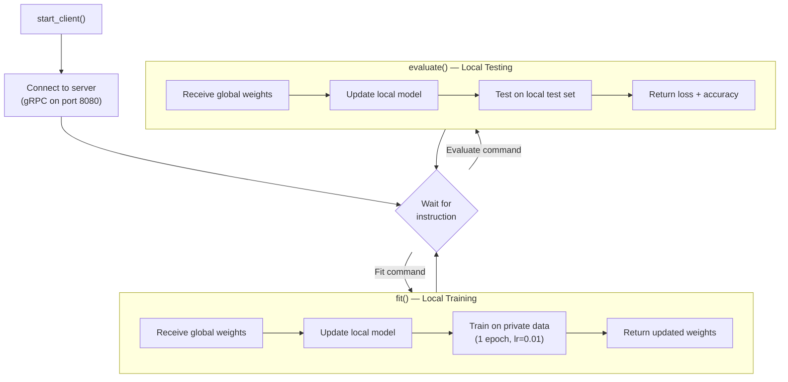

# The Client

!!! tip "You will learn"
    - How a client (hospital) participates in Federated Learning
    - The local training loop — `fit()` and `evaluate()`
    - How model weights are exchanged with the server
    - Why privacy is enforced at the client level

## Overview

Each client represents a **hospital**. It holds private patient data, trains the model locally, and communicates only model weights with the server.

```
src/client.py
├── HeartDiseaseClient    → Flower NumPyClient implementation
│   ├── get_parameters()  → Extract local model weights
│   ├── fit()             → Local training (the core)
│   └── evaluate()        → Local evaluation
└── start_client()        → Connection entry point
```

## Client Lifecycle



## The HeartDiseaseClient Class

The client implements Flower's `NumPyClient` interface — the standard way to participate in a federation.

### Constructor

```python
class HeartDiseaseClient(fl.client.NumPyClient):
    def __init__(self, client_id, trainloader, testloader, num_examples):
        self.client_id = client_id          # Hospital identifier
        self.trainloader = trainloader      # Private training data
        self.testloader = testloader        # Private test data
        self.num_examples = num_examples    # Dataset size
        self.model = HeartDiseaseNet()      # Local model instance
```

!!! warning "Privacy boundary"
    `trainloader` and `testloader` contain **actual patient records** as PyTorch tensors. These objects exist only in the client's memory and are never serialized, transmitted, or made accessible to the server.

### The `fit()` method — Local Training

This is the heart of the client. It runs when the server says "Train!"

```python
def fit(self, parameters, config):
    # 1. Update local model with global parameters
    set_parameters(self.model, parameters)       # (1)!

    # 2. Train on local private data
    epochs = config.get("epochs", 1)
    lr = config.get("lr", 0.01)
    loss = train_model(self.model, self.trainloader, epochs=epochs, lr=lr)  # (2)!

    # 3. Return updated weights (Privacy preserved!)
    return get_parameters(self.model), self.num_examples, {"loss": loss}    # (3)!
```

1. The client **overwrites** its local model with the global weights. This ensures it starts from the collective knowledge of all hospitals.
2. The training happens **entirely locally** using this hospital's private data. The server has no visibility into this process.
3. Only **model weights** (NumPy arrays) and the **sample count** are returned. Zero patient records leave the client.

### The `evaluate()` method — Local Testing

Runs when the server says "Test yourself!"

```python
def evaluate(self, parameters, config):
    set_parameters(self.model, parameters)
    loss, accuracy = test_model(self.model, self.testloader)
    return loss, len(self.testloader.dataset), {"accuracy": accuracy}
```

The evaluation uses the **test set** — data the model hasn't trained on. This gives an honest measure of how well the global model performs on this hospital's patient population.

## Privacy Audit Trail

Let's trace every piece of data and verify nothing sensitive leaves the client:

| Data | Created at | Sent to server? |
|------|-----------|:---:|
| Raw patient features (age, cholesterol, ...) | `data_loader.py` | :material-close: Never |
| PyTorch tensors (trainloader) | `data_loader.py` | :material-close: Never |
| Training gradients | `train_model()` | :material-close: Never |
| Local loss values | `train_model()` | :material-check: Aggregate only |
| Updated model weights | `get_parameters()` | :material-check: Yes — these are safe |
| Number of training examples | Constructor | :material-check: Yes — a single integer |
| Accuracy percentage | `test_model()` | :material-check: Yes — a single float |

## Connecting to a Server

For standalone deployment (without the simulation engine):

```python
def start_client(client_id, trainloader, testloader, num_examples,
                 server_address="127.0.0.1:8080"):
    client = HeartDiseaseClient(client_id, trainloader, testloader, num_examples)
    fl.client.start_client(
        server_address=server_address,
        client=client.to_client()
    )
```

=== "Running from script"

    ```bash
    # Terminal 1: Start the server
    python -c "from fl_core.server import start_server; start_server()"

    # Terminal 2: Start Cleveland client
    python scripts/run_client.py 0

    # Terminal 3: Start Hungarian client
    python scripts/run_client.py 1
    ```

=== "Running via simulation"

    ```bash
    # Single command — handles everything
    python run_simulation.py
    ```

## Key Takeaway

The client is "dumb" but **secure**. It does exactly what the server asks (train or evaluate), but performs those actions strictly on its own private data vault. It never exposes a single patient record — only mathematical model parameters cross the wire.
