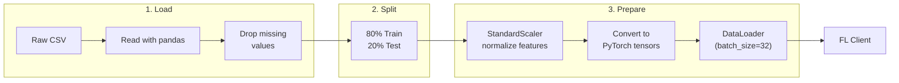

# Data Pipeline

!!! tip "You will learn"
    - How raw CSV files become PyTorch DataLoaders
    - The three-stage pipeline: load, clean, prepare
    - Why each hospital's data is processed independently
    - How normalization and batching work

## Overview

The data pipeline transforms raw hospital CSV files into training-ready PyTorch DataLoaders. Crucially, each hospital's data is processed **independently** — simulating the real-world scenario where hospitals cannot share statistics.

```
src/data_loader.py
├── load_hospital_data()   → Read & clean one hospital's CSV
├── load_all_hospitals()   → Load all supported hospitals
└── prepare_client_data()  → Normalize, split, batch → DataLoader
```

## Pipeline Stages



## Stage 1: Loading Raw Data

### The dataset

We use the **UCI Heart Disease** dataset — patient records from multiple hospitals with 13 medical features and a heart disease diagnosis.

| Feature | Description | Type |
|---------|-------------|------|
| `age` | Age in years | Numeric |
| `sex` | 1 = male, 0 = female | Binary |
| `cp` | Chest pain type (0-3) | Categorical |
| `trestbps` | Resting blood pressure (mm Hg) | Numeric |
| `chol` | Serum cholesterol (mg/dl) | Numeric |
| `fbs` | Fasting blood sugar > 120 mg/dl | Binary |
| `restecg` | Resting ECG results (0-2) | Categorical |
| `thalach` | Maximum heart rate achieved | Numeric |
| `exang` | Exercise-induced angina | Binary |
| `oldpeak` | ST depression from exercise | Numeric |
| `slope` | Slope of peak exercise ST | Categorical |
| `ca` | Number of major vessels (0-3) | Numeric |
| `thal` | Thalassemia type (3, 6, 7) | Categorical |
| `num` | Diagnosis (0 = no disease, 1-4 = disease) | **Target** |

### Loading one hospital

```python
def load_hospital_data(hospital_name, data_dir='data/heart_disease/raw'):
    file_map = {
        'cleveland': 'processed.cleveland.data',
        'hungarian': 'processed.hungarian.data',
    }

    filename = file_map.get(hospital_name.lower())
    filepath = Path(data_dir) / filename

    df = pd.read_csv(filepath, names=COLUMNS, na_values='?')
    df['target'] = (df['num'] > 0).astype(int)    # (1)!

    X = df.drop(['num', 'target'], axis=1)
    y = df['target']
    X = X.fillna(X.mean())                         # (2)!

    return X.values, y.values
```

1. The original dataset has 5 classes (0-4). We convert to **binary classification**: 0 = no disease, 1 = has disease.
2. Missing values (`?` in the CSV) are replaced with the **column mean** from this hospital only — not a global mean across hospitals.

!!! warning "Privacy note"
    `X.fillna(X.mean())` uses the **local** mean. Each hospital computes its own statistics from its own data. There is no shared global mean — that would require cross-hospital data sharing.

### Loading all hospitals

```python
def load_all_hospitals(data_dir='data/heart_disease/raw'):
    hospitals = ['cleveland', 'hungarian']
    hospital_data = []

    for hospital in hospitals:
        X, y = load_hospital_data(hospital, data_dir)
        hospital_data.append((hospital, X, y))

    return hospital_data  # List of (name, X, y) tuples
```

## Stage 2: Train/Test Split

```python
X_train, X_test, y_train, y_test = train_test_split(
    X, y, test_size=0.2, random_state=42, stratify=y   # (1)!
)
```

1. `stratify=y` ensures the disease/healthy ratio is preserved in both splits. Without this, you might accidentally put all disease patients in the test set.

| Hospital | Total | Train (80%) | Test (20%) |
|----------|:-----:|:-----------:|:----------:|
| Cleveland | ~300 | ~240 | ~60 |
| Hungarian | ~290 | ~232 | ~58 |

## Stage 3: Preparation

### Normalization

```python
scaler = StandardScaler()
X_train = scaler.fit_transform(X_train)   # (1)!
X_test = scaler.transform(X_test)         # (2)!
```

1. `fit_transform` on training data: compute mean & std, then normalize.
2. `transform` on test data: use the **same** mean & std from training. This prevents data leakage.

??? example "Deep Dive — Why normalize?"
    Raw features have vastly different scales:

    | Feature | Range | Example values |
    |---------|-------|---------------|
    | Age | 29-77 | 54, 67, 41 |
    | Cholesterol | 126-564 | 233, 286, 197 |
    | Blood pressure | 94-200 | 130, 145, 110 |
    | Oldpeak | 0-6.2 | 1.4, 0.0, 3.5 |

    Without normalization, cholesterol (range ~400) would dominate over oldpeak (range ~6) simply because its values are larger. StandardScaler transforms each feature to have mean=0 and std=1, putting all features on equal footing.

### Tensor conversion

```python
X_train_tensor = torch.FloatTensor(X_train)
y_train_tensor = torch.FloatTensor(y_train).unsqueeze(1)  # (1)!
```

1. `unsqueeze(1)` reshapes labels from `[batch_size]` to `[batch_size, 1]` to match the network's output shape.

### DataLoader creation

```python
trainloader = DataLoader(train_dataset, batch_size=32, shuffle=True)   # (1)!
testloader = DataLoader(test_dataset, batch_size=32)                   # (2)!
```

1. **Shuffle training data** each epoch — prevents the model from memorizing the order of patients.
2. **Don't shuffle test data** — evaluation should be deterministic.

The DataLoader handles **batching**: instead of feeding all 240 patients at once, it serves them in groups of 32. This is more memory-efficient and leads to better gradient updates.

## Complete Pipeline

```python
# Full pipeline for one hospital
X, y = load_hospital_data('cleveland')
trainloader, testloader, num_examples = prepare_client_data(X, y)

# trainloader: 240 patients in batches of 32 → 8 batches
# testloader: 60 patients in batches of 32 → 2 batches
# num_examples: 240 (used for FedAvg weighting)
```

## Key Takeaway

The most important concept: **each hospital's data is processed independently**. The StandardScaler at Cleveland only sees Cleveland data. The train/test split at Hungarian only touches Hungarian data. This complete isolation is what makes the system privacy-preserving — even the preprocessing statistics never leave the hospital.
