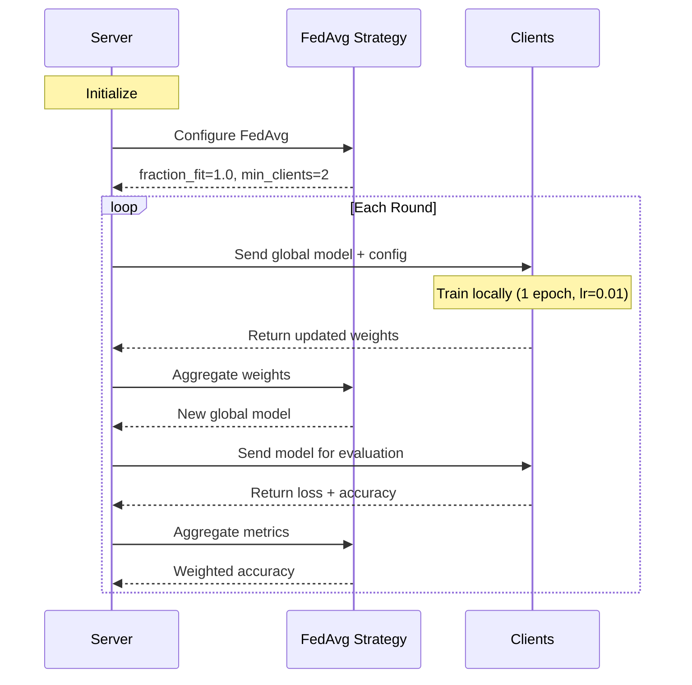

# The Server

!!! tip "You will learn"
    - How the FL server orchestrates the training process
    - How the FedAvg strategy is configured
    - How training hyperparameters are distributed to clients
    - How evaluation metrics are aggregated

## Overview

The server is the **conductor** of the federated orchestra. It never touches patient data — it only manages the global model and coordinates the training process.

```
src/server.py
├── weighted_average()   → Custom metric aggregation
└── start_server()       → Server initialization & launch
```

## Server Flowchart



## The FedAvg Strategy

The strategy is the **rulebook** that governs the federation. Every decision — who trains, how long, how results are combined — is defined here.

```python
strategy = fl.server.strategy.FedAvg(
    fraction_fit=1.0,           # (1)!
    fraction_evaluate=1.0,      # (2)!
    min_fit_clients=2,          # (3)!
    min_evaluate_clients=2,
    min_available_clients=2,
    evaluate_metrics_aggregation_fn=weighted_average,  # (4)!
)
```

1. Use **100%** of available clients for training every round. In production with hundreds of clients, you might sample 10-20%.
2. Evaluate on **100%** of clients. This gives us accuracy metrics from every hospital.
3. **Don't start** a round until both hospitals (Cleveland & Hungarian) are connected and ready.
4. Our custom function that computes overall accuracy as a weighted average.

### Configuration functions

The server controls **how** clients train by sending configuration with each round:

```python
strategy.on_fit_config_fn = lambda r: {
    "epochs": 1,    # Train for 1 epoch per round
    "lr": 0.01,     # Learning rate
    "round": r,     # Current round number
}
```

!!! info "Central control"
    By changing these values **on the server**, you instantly change the behavior of **all clients**. Want longer training? Set `epochs: 5`. Want finer updates? Reduce `lr` to `0.001`. No client code changes needed.

## Metric Aggregation

After each evaluation round, each hospital reports its local accuracy. The server needs to combine these into a single global accuracy.

```python
def weighted_average(metrics: List[Tuple[int, Metrics]]) -> Metrics:
    total_examples = sum(num_examples for num_examples, _ in metrics)
    accuracies = [num_examples * m["accuracy"] for num_examples, m in metrics]
    weighted_accuracy = sum(accuracies) / total_examples
    return {"accuracy": weighted_accuracy}
```

**Why weighted?** If Cleveland has 300 patients and reports 85% accuracy, while Hungarian has 290 patients and reports 80% accuracy, the global accuracy is:

```
(300 × 0.85 + 290 × 0.80) / 590 = 0.8254 → 82.5%
```

Not a simple `(85 + 80) / 2 = 82.5%` — though in this case the result is close because both datasets are similar in size.

## Starting the Server

```python
def start_server(num_rounds=5, num_clients=2, server_address="0.0.0.0:8080"):
    # ... strategy setup ...

    fl.server.start_server(
        server_address=server_address,
        config=fl.server.ServerConfig(num_rounds=num_rounds),
        strategy=strategy,
    )
```

| Parameter | Default | Description |
|-----------|---------|-------------|
| `num_rounds` | 5 | Number of FL training rounds |
| `num_clients` | 2 | Minimum clients before starting |
| `server_address` | `0.0.0.0:8080` | gRPC address for client connections |

## Key Takeaway

The server **never sees data**. It only sees **weights** (floating-point numbers) and **metrics** (loss, accuracy). It blindly averages the weights using FedAvg to produce a progressively smarter global model — round by round.
