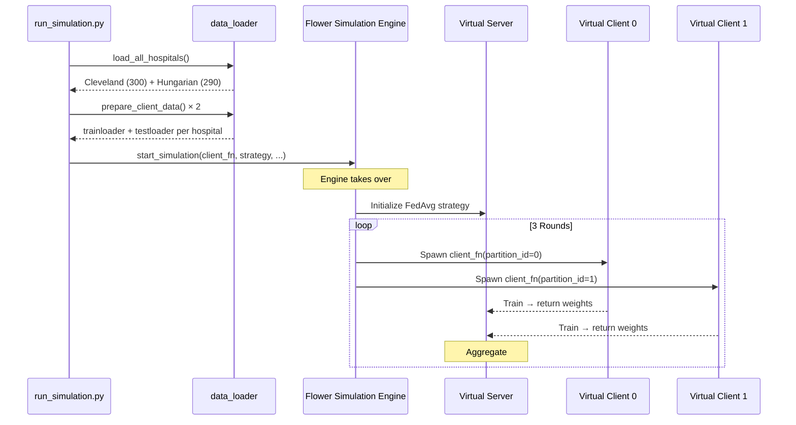

# Running a Simulation

!!! tip "You will learn"
    - What the simulation engine does under the hood
    - How clients and server run in a single process
    - How to configure training rounds and client resources
    - How to interpret the output

## Overview

The simulation script (`run_simulation.py`) runs the **entire** federated system — server, clients, data loading — in a single process. This is the easiest way to understand and experiment with FL.

Under the hood, Flower's `start_simulation` function spawns virtual clients using Ray, a distributed computing framework, while managing the server loop in the main thread.

## Architecture



## The Code

### Step 1: Load data

```python
hospital_data = load_all_hospitals()

client_resources = {}
for i, (name, X, y) in enumerate(hospital_data):
    trainloader, testloader, num_examples = prepare_client_data(X, y)
    client_resources[str(i)] = (trainloader, testloader, num_examples)
```

Each hospital's data is loaded and prepared **once**, then stored in a dictionary keyed by client ID:

- `"0"` → Cleveland (trainloader, testloader, 240 training samples)
- `"1"` → Hungarian (trainloader, testloader, 232 training samples)

### Step 2: Define the client factory

```python
def client_fn(context: fl.common.Context) -> fl.client.Client:
    partition_id = context.node_config["partition-id"]    # (1)!
    trainloader, testloader, num_examples = client_resources[str(partition_id)]
    return HeartDiseaseClient(
        partition_id, trainloader, testloader, num_examples
    ).to_client()
```

1. Flower assigns each virtual client a `partition-id` (0 or 1). This maps directly to our hospital data.

!!! info "Note"
    `client_fn` is a **factory function**. Flower calls it every time it needs a client instance. The function looks up the right hospital data and returns a fresh `HeartDiseaseClient`.

### Step 3: Configure the strategy

```python
strategy = fl.server.strategy.FedAvg(
    fraction_fit=1.0,
    fraction_evaluate=1.0,
    min_fit_clients=2,
    min_evaluate_clients=2,
    min_available_clients=2,
    evaluate_metrics_aggregation_fn=weighted_average,
)

strategy.on_fit_config_fn = lambda r: {"epochs": 1, "lr": 0.01, "round": r}
```

### Step 4: Launch

```python
fl.simulation.start_simulation(
    client_fn=client_fn,
    num_clients=2,                                          # (1)!
    config=fl.server.ServerConfig(num_rounds=3),            # (2)!
    strategy=strategy,
    client_resources={"num_cpus": 1, "num_gpus": 0.0},     # (3)!
)
```

1. Total number of clients in the federation.
2. Run 3 rounds of federated training.
3. Each virtual client gets 1 CPU core and no GPU. For larger models, allocate GPU fractions.

## Configuration Reference

| Parameter | Default | What it controls |
|-----------|---------|-----------------|
| `num_clients` | 2 | Number of virtual hospitals |
| `num_rounds` | 3 | Federated training rounds |
| `epochs` | 1 | Local training epochs per round |
| `lr` | 0.01 | Learning rate |
| `batch_size` | 32 | Training batch size |
| `test_size` | 0.2 | Fraction of data reserved for testing |

## Interpreting the Output

When you run `python run_simulation.py`, you'll see output like:

```
Loading data from hospitals:
------------------------------------------------------------
Cleveland       : 303 patients, 165 with disease (54.5%)
Hungarian       : 294 patients, 139 with disease (47.3%)
------------------------------------------------------------
TOTAL           : 597 patients

Client 0: Cleveland prepared with 242 training samples.
Client 1: Hungarian prepared with 235 training samples.

Starting Simulation Engine...
```

After each round, Flower logs the aggregated metrics. Watch for:

- **Loss decreasing** across rounds → the model is learning
- **Accuracy increasing** across rounds → predictions are improving
- **Both clients contributing** → federation is working correctly

## Simulation vs. Distributed

| | Simulation | Distributed |
|-|-----------|-------------|
| **Processes** | Single process | Separate server + client processes |
| **Networking** | Simulated (in-memory) | Real gRPC connections |
| **Use case** | Development, experimentation | Production, real deployment |
| **Launch** | `python run_simulation.py` | Start server, then each client separately |
| **Speed** | Fast (no network overhead) | Slower (network latency) |

=== "Simulation mode (recommended for development)"

    ```bash
    python run_simulation.py
    ```

=== "Distributed mode (real deployment)"

    ```bash
    # Terminal 1: Server
    python -c "from fl_core.server import start_server; start_server()"

    # Terminal 2: Cleveland
    python scripts/run_client.py 0

    # Terminal 3: Hungarian
    python scripts/run_client.py 1
    ```

## Key Takeaway

The simulation engine lets you run the entire federated system — server, multiple clients, data loading, training, aggregation — in a **single command**. It's functionally identical to running separate processes, but without the complexity of managing multiple terminals and network connections. Use it for development and experimentation; switch to distributed mode for production.
