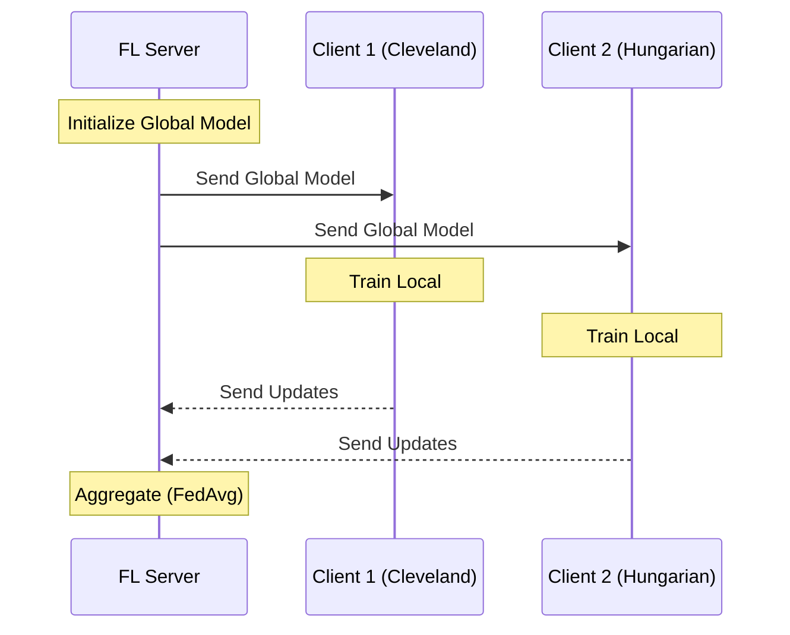

---
hide:
  - navigation
---

# Simple FL Project Overview

This document provides a high-level overview of your Federated Learning (FL) implementation for heart disease prediction using the **Flower (flwr)** framework.

## 1. High-Level Architecture

Your project simulates a Federated Learning system where multiple hospitals collaborate to train a shared AI model without sharing patient data.

- **Central Server**: Orchestrates the training. It manages the global model and coordinates updates.
- **Clients (Hospitals)**: Local entities that hold private patient data. They train the model locally and send *only* the model updates (weights) back to the server.

### System Diagram

## 2. Key Components

### A. Data Preparation (`main.py` & `simple_fl/data_loader.py`)
- **Source**: UCI Heart Disease Dataset.
- **Partitioning**: The data is split naturally by hospital (Cleveland, Hungarian, Switzerland, VA).
- **Privacy**: Each client loads *only* its own hospital's data. This simulates real-world privacy where data acts as a silo.
- **Processing**:
  - Drops rows with missing values.
  - Normalizes features (StandardScaler).
  - Converts to PyTorch tensors.

### B. The Model (`simple_fl/model.py`)
- **Type**: Simple Neural Network (Multi-Layer Perceptron).
- **Structure**:
  - **Input**: 13 medical features (Age, Sex, Cholesterol, etc.).
  - **Hidden Layers**: Two layers (64 & 32 neurons) with ReLU activation.
  - **Output**: 1 neuron (Sigmoid) → Probability of heart disease.
- **Loss Function**: Binary Cross Entropy (appropriate for Yes/No classification).

### C. The Client (`simple_fl/client.py`)
- **Role**: Represents a single hospital.
- **Key Methods**:
  - `fit()`: Receives the global model, trains it on local data for a few epochs, and returns the *difference* (updated weights).
  - `evaluate()`: Tests the global model's accuracy on local, unseen test data.

### D. The Server (`simple_fl/server.py`)
- **Role**: Conductor of the orchestra.
- **Strategy**: `FedAvg` (Federated Averaging).
  - It collects weights from all clients.
  - It averages them (weighted by how much data each client has).
  - It produces the new "Global Model".
- **Rounds**: The process (Send -> Train -> Aggregate) repeats for `num_rounds` (default 5).

## 3. How It All Works Together

1.  **Start Server**: You run the server first. It sits and waits for connections.
2.  **Start Clients**: You run client scripts (e.g., in separate terminals).
3.  **Connection**: Clients connect to the server.
4.  **Training Loop**:
    - **Download**: Clients download the current global model.
    - **Local Training**: Each client improves the model using their unique, private patients.
    - **Upload**: Clients upload their *knowledge* (model weights), not the data.
    - **Aggregation**: Server combines the knowledge from all hospitals.
5.  **Result**: A global model that has learned from all hospitals' data without ever seeing the raw patient records.

## 4. Why This Matters
This architecture proves that you can build effective medical AI models across institutions without violating patient privacy laws (like HIPAA or GDPR), as the raw data never leaves the hospital's server.
