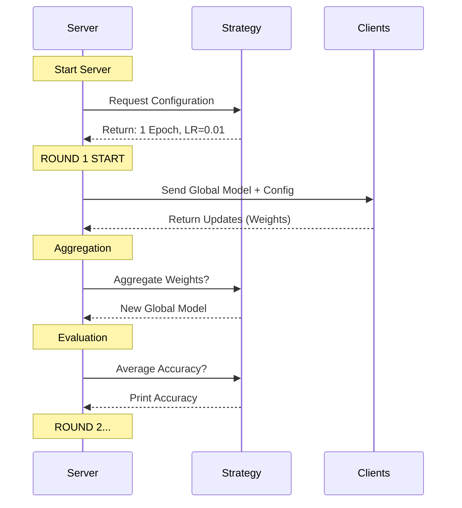

# FL Server Guide
<!--  -->
This document explains the logic within `src/fl_core/server.py`. The Server is the "conductor" of the Federated Learning orchestra.

## Server Logic Flowchart



## Detailed Breakdown

### 1. The Strategy (`FedAvg`)
The most important part of the server is the **Strategy**. We use `FedAvg` (Federated Averaging).
Think of the strategy as the "rulebook" for the federation.

-   **`min_fit_clients=2`**: The server will PAUSE and wait until at least 2 clients (Cleveland & Hungarian) are connected before starting training.
-   **`fraction_fit=1.0`**: In every round, ask **100%** of connected clients to train.
-   **`weighted_average`**: This custom function (lines 9-14) calculates the true global accuracy.
    -   *Why?* If Cleveland has 200 patients and Hungarian has 100, Cleveland's accuracy should count for twice as much.

### 2. The Configuration Functions
You will see two small functions defined inside `start_server`:

```python
strategy.on_fit_config_fn = lambda r: {"epochs": 1, "lr": 0.01, "round": r}
```

This is how the Server controls the Clients.
-   **`epochs`: 1**: Tells clients "Train for only 1 pass through your data this round."
-   **`lr`: 0.01**: Tells clients "Use a learning rate of 0.01."

By changing these values on the Server, you change the behavior of ALL clients instantly!

### 3. The Loop (`start_server`)
The `fl.server.start_server` function (lines 36-40) starts the infinite loop:
1.  Sample clients (Wait for 2).
2.  Send them the model.
3.  Receive their updates.
4.  Average the updates (Math magic!).
5.  Repeat for `num_rounds` (default 5).

## Key Takeaway
The Server **never sees data**. It only sees **weights** (model parameters). It blindly averages these weights to produce a smarter global model.
