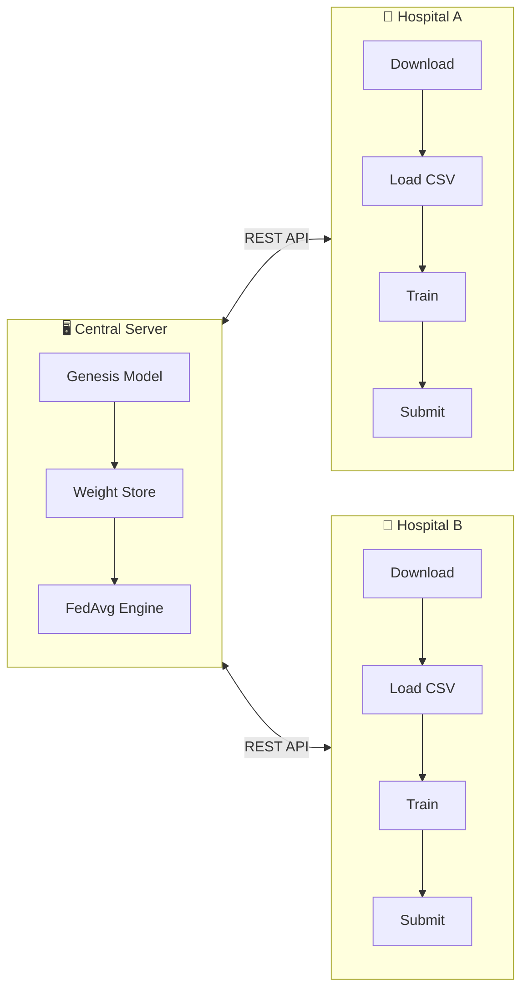
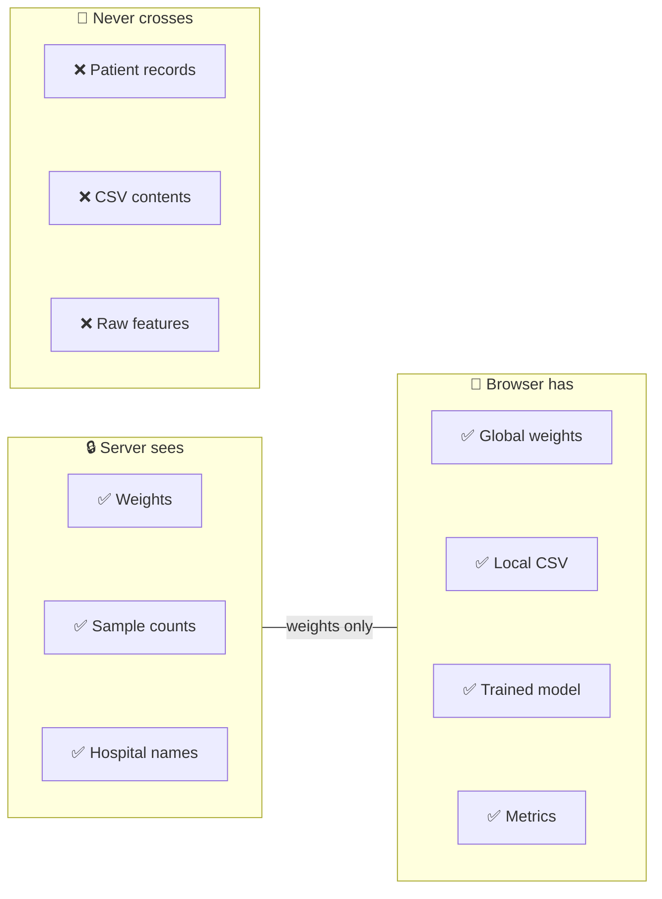

# System Architecture

The platform is composed of two independently deployed components that communicate exclusively via REST APIs. This separation ensures that the aggregation server never has access to raw data, and the client never exposes its local training data to the network.

---

## Architecture Overview



<Callout type="info" title="Design Philosophy">
  The architecture enforces a strict **data boundary**: the server only sees model weights (floating-point arrays), and the client only sees its own local data. There is no mechanism — intentional or accidental — for patient data to cross this boundary.
</Callout>

---

## Central Aggregation Server

The backend is a stateless **FastAPI** application that serves as the coordination layer for the entire federated network. It can be deployed on any container platform.

### Responsibilities

| Responsibility | Description |
|---------------|-------------|
| **Genesis Model** | Creates the initial neural network using PyTorch and publishes its weights as JSON |
| **Tensor Conversion** | Transposes PyTorch weight matrices `[out, in]` → TF.js format `[in, out]` |
| **Weight Distribution** | Serves the current global model via `GET /api/model/global/json` |
| **Submission Intake** | Receives locally-trained weights from hospitals via `POST /api/hospital/{name}/submit` |
| **Federated Averaging** | Aggregates all submitted weights using sample-weighted FedAvg to produce the next global round |

### The Neural Network

The genesis model is a **multi-layer perceptron (MLP)** built in PyTorch for binary classification. The current experiment uses heart disease prediction with 13 clinical features:

```python
class HeartDiseaseNet(nn.Module):
    def __init__(self):
        super().__init__()
        self.fc1 = nn.Linear(13, 64)    # 13 clinical features → 64 neurons
        self.fc2 = nn.Linear(64, 32)    # Hidden layer
        self.fc3 = nn.Linear(32, 2)     # Output: [no disease, disease]

    def forward(self, x):
        x = torch.relu(self.fc1(x))
        x = torch.relu(self.fc2(x))
        return self.fc3(x)
```

<Callout type="warn" title="Why 13 Features?">
  The Cleveland Heart Disease dataset contains 13 clinical attributes: age, sex, chest pain type, resting blood pressure, cholesterol, fasting blood sugar, resting ECG, max heart rate, exercise-induced angina, ST depression, slope of peak exercise ST segment, number of major vessels, and thalassemia type.
</Callout>

### Tensor Format Conversion

PyTorch and TensorFlow.js use **opposite weight matrix conventions**. This is a critical detail that the server handles transparently:

<Tabs items={["PyTorch Format", "TF.js Format"]}>
  <Tab value="PyTorch Format">
    ```python
    # PyTorch: weight shape is [out_features, in_features]
    fc1.weight.shape  # → torch.Size([64, 13])
    fc1.bias.shape    # → torch.Size([64])
    ```

    PyTorch stores weights as `[output_dim, input_dim]` because it performs `y = xW^T + b` internally.
  </Tab>

  <Tab value="TF.js Format">
    ```javascript
    // TF.js: weight shape is [in_features, out_features]
    layer1.kernel.shape  // → [13, 64]
    layer1.bias.shape    // → [64]
    ```

    TensorFlow.js stores weights as `[input_dim, output_dim]` because it performs `y = xW + b` directly.
  </Tab>
</Tabs>

The server transposes every weight matrix upon both **publishing** (PyTorch → JSON) and **receiving** (JSON → aggregation):

```python
# On publish: transpose PyTorch weights for TF.js consumption
weights_json = [param.detach().numpy().T.tolist()
                for param in model.parameters()]

# On receive: transpose submitted TF.js weights back for aggregation
kernel = np.array(submitted_kernel).T  # [in, out] → [out, in]
```

---

## Hospital Client

The frontend is a **Next.js** application that serves as each hospital's private training environment. Every hospital runs an independent instance in their browser.

### Responsibilities

| Responsibility | Description |
|---------------|-------------|
| **Federation Portal** | Hospitals join by entering their name and connecting to the global network |
| **Model Sync** | Downloads the current global model weights and compiles a local TF.js model |
| **Secure Data Loading** | Reads local CSV files via `FileReader` — data never leaves the browser |
| **Local Training** | Executes `model.fit()` with live training metrics streamed to the UI |
| **Weight Extraction** | Extracts trained weights via `model.getWeights()` and `.dataSync()` |
| **Submission** | POSTs only the weight arrays (no patient data) back to the server |

### Project Structure

```
frontend/
├── app/
│   ├── page.tsx              # Landing page
│   ├── layout.tsx            # Root layout
│   ├── globals.css           # Global styles
│   ├── hospital/
│   │   └── [name]/
│   │       └── page.tsx      # Hospital training dashboard
│   ├── server/
│   │   └── page.tsx          # Server admin dashboard
│   └── docs/
│       ├── layout.tsx        # Docs layout
│       └── [[...slug]]/
│           └── page.tsx      # Dynamic doc pages
├── components/
│   ├── mdx.tsx               # MDX component map
│   ├── theme-provider.tsx    # Theme context
│   └── theme-toggle.tsx      # Dark/light toggle
├── lib/
│   ├── api.ts                # Backend API client
│   ├── source.ts             # Fumadocs source loader
│   └── layout.shared.tsx     # Shared nav config
└── content/
    └── docs/
        ├── index.mdx         # Introduction
        ├── architecture.mdx  # System Architecture
        ├── frontend.mdx      # Hospital Dashboard
        ├── api.mdx           # API Reference
        └── deployment.mdx    # Deployment Guide
```

---

## Data Flow: One Complete Round

Here is a detailed walkthrough of a single federated learning round from start to finish:

<Steps>
  <Step>
    ### Round Initialization

    The server operator triggers `POST /api/model/publish`. The server creates a new PyTorch model, transposes its weights to TF.js format, and stores them in memory as the **v1 global model**. The server reports `current_round: 1` via the status endpoint.
  </Step>

  <Step>
    ### Hospital Downloads Model

    Hospital A navigates to `/hospital/cleveland` and clicks "Fetch Global Model." The browser sends `GET /api/model/global/json` and receives a JSON array of weight matrices. TensorFlow.js compiles a local `tf.sequential` model and injects these weights using `model.setWeights()`.
  </Step>

  <Step>
    ### Local Data Loading

    The hospital selects their private `processed.cleveland.csv` file. The browser's `FileReader` reads the file contents into memory. The CSV is parsed, `?` values are filtered, and the data is split into feature tensors (`tf.tensor2d`) and one-hot encoded labels (`tf.oneHot`).

    **At this point, patient data exists only in the browser's JavaScript heap. No HTTP request is made.**
  </Step>

  <Step>
    ### In-Browser Training

    The hospital clicks "Train." TensorFlow.js runs `model.fit()` for the configured number of epochs. The WebGL backend (or WASM fallback) accelerates computation. Live metrics (loss, accuracy) stream to the dashboard via async callbacks.

    ```javascript
    await model.fit(featureTensor, labelTensor, {
      epochs: 50,
      batchSize: 32,
      validationSplit: 0.2,
      callbacks: {
        onEpochEnd: (epoch, logs) => {
          updateTrainingChart(epoch, logs.loss, logs.val_acc);
        }
      }
    });
    ```
  </Step>

  <Step>
    ### Weight Extraction and Submission

    After training, the hospital extracts the updated weights:

    ```javascript
    const weights = model.getWeights();
    const weightData = weights.map(w => Array.from(w.dataSync()));
    ```

    These arrays are POSTed to `POST /api/hospital/cleveland/submit` along with the sample count. The server receives only mathematical weight values — no patient data.
  </Step>

  <Step>
    ### Federated Averaging

    Once enough hospitals have submitted, the server runs FedAvg. Each hospital's weights are averaged proportionally to their sample count:

    ```
    w(t+1) = SUM[ (n_k / n) * w_k(t+1) ]  for k = 1..K
    ```

    The result becomes the **v2 global model**, and the cycle repeats. Each round, the model improves by learning from distributed knowledge without any single hospital revealing their data.
  </Step>
</Steps>

---

## Security Boundary Model



<Callout type="info" title="Stateless by Design">
  The server has **no database**, **no file storage for patient data**, and **no session state**. If the server restarts, only the current global model weights need to be re-initialized. This dramatically reduces the attack surface — there is simply nothing to breach.
</Callout>
