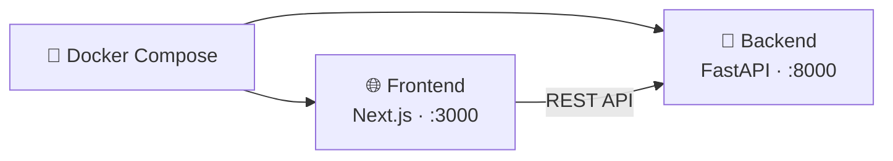
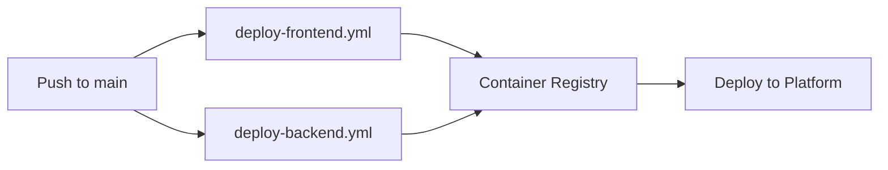

# Deployment Guide

The FL platform is fully containerized with **Docker** and can be deployed on any platform that runs containers — your laptop, a VPS, AWS, Azure, GCP, DigitalOcean, Railway, Fly.io, or bare metal. The stack consists of two independent services: a **FastAPI backend** and a **Next.js frontend**.

---

## Architecture



---

## Quick Start with Docker Compose

The fastest way to run the full stack. One command, both services up.

```yaml title="docker-compose.yml"
services:
  backend:
    build:
      context: ./backend
      dockerfile: Dockerfile
    ports:
      - "${BACKEND_PORT:-8000}:8000"
    environment:
      - PORT=8000
    healthcheck:
      test: ["CMD", "python", "-c", "import urllib.request; urllib.request.urlopen('http://localhost:8000/health')"]
      interval: 30s
      timeout: 5s
      retries: 3
      start_period: 10s
    restart: unless-stopped

  frontend:
    build:
      context: ./frontend
      dockerfile: Dockerfile
      args:
        NEXT_PUBLIC_API_URL: ${NEXT_PUBLIC_API_URL:-http://localhost:8000}
    ports:
      - "${FRONTEND_PORT:-3000}:3000"
    depends_on:
      backend:
        condition: service_healthy
    restart: unless-stopped
```

```bash
# Clone and start the entire stack
git clone https://github.com/your-repo/fl-thesis-project.git
cd fl-thesis-project

# Option 1: Run with defaults (localhost)
docker compose up --build

# Option 2: Point to a remote backend
NEXT_PUBLIC_API_URL=https://api.example.com docker compose up --build
```

Once running:
- **Frontend** → `http://localhost:3000`
- **Backend API** → `http://localhost:8000`
- **API Docs (Swagger)** → `http://localhost:8000/docs`

<Callout type="info" title="That's it">
  No cloud account needed. Defaults work out of the box for local development. The frontend waits for the backend health check to pass before starting. Copy `.env.example` to `.env` to customize ports or the API URL.
</Callout>

---

## Dockerfiles

Both services use production-optimized Dockerfiles.

<Tabs items={["Frontend", "Backend"]}>
  <Tab value="Frontend">
    A **3-stage build** that produces a minimal production image (~150MB):

    ```dockerfile
    FROM node:20-alpine AS base

    # ── Stage 1: Install dependencies ──
    FROM base AS deps
    RUN apk add --no-cache libc6-compat
    WORKDIR /app
    COPY package.json package-lock.json* ./
    RUN npm ci

    # ── Stage 2: Build the application ──
    FROM base AS builder
    WORKDIR /app
    COPY --from=deps /app/node_modules ./node_modules
    COPY . .
    ENV NEXT_TELEMETRY_DISABLED=1
    ARG NEXT_PUBLIC_API_URL
    ENV NEXT_PUBLIC_API_URL=${NEXT_PUBLIC_API_URL}
    RUN npm run build

    # ── Stage 3: Production runtime ──
    FROM base AS runner
    WORKDIR /app
    ENV NODE_ENV=production
    RUN addgroup --system --gid 1001 nodejs
    RUN adduser --system --uid 1001 nextjs
    COPY --from=builder /app/public ./public
    COPY --from=builder --chown=nextjs:nodejs /app/.next/standalone ./
    COPY --from=builder --chown=nextjs:nodejs /app/.next/static ./.next/static
    USER nextjs
    EXPOSE 3000
    CMD ["node", "server.js"]
    ```

    <Callout type="warn" title="Build-Time API URL">
      `NEXT_PUBLIC_API_URL` is baked into the JavaScript bundle at build time. To point the frontend to a different backend, you must **rebuild** the image:

      ```bash
      docker build --build-arg NEXT_PUBLIC_API_URL=https://api.example.com -t frontend ./frontend
      ```
    </Callout>
  </Tab>

  <Tab value="Backend">
    A single-stage image with PyTorch and sample data included:

    ```dockerfile
    FROM python:3.11-slim
    WORKDIR /app

    RUN apt-get update && apt-get install -y --no-install-recommends \
        build-essential && rm -rf /var/lib/apt/lists/*

    COPY requirements.txt .
    RUN pip install --no-cache-dir -r requirements.txt
    COPY . .

    ENV PORT=8000
    EXPOSE $PORT
    CMD ["sh", "-c", "uvicorn api.main:app --host 0.0.0.0 --port ${PORT}"]
    ```

    <Callout type="info" title="Sample Data Included">
      The `data/` directory with sample CSV files (Cleveland, Hungarian, etc.) is bundled in the image. The demo works out of the box — no external data sources needed.
    </Callout>

    **Key dependencies:**

    | Package | Purpose |
    |---------|---------|
    | `fastapi` | Async REST API framework |
    | `uvicorn` | Production ASGI server |
    | `torch` | PyTorch for model creation |
    | `numpy` | Tensor operations and FedAvg |
    | `python-multipart` | Form data parsing |
  </Tab>
</Tabs>

---

## Deploy Anywhere

Since both services are standard Docker containers, you can deploy them on any platform. Here are examples for the most common options.

<Tabs items={["Any VPS / Server", "Google Cloud Run", "AWS (ECS / App Runner)", "Railway / Fly.io"]}>
  <Tab value="Any VPS / Server">
    Works on any machine with Docker installed — Ubuntu, Debian, Amazon Linux, etc.

    ```bash
    # SSH into your server
    ssh user@your-server-ip

    # Install Docker (if not installed)
    curl -fsSL https://get.docker.com | sh

    # Clone and deploy
    git clone https://github.com/your-repo/fl-thesis-project.git
    cd fl-thesis-project

    # Set the public backend URL for the frontend build
    export BACKEND_URL=http://your-server-ip:8000

    # Start both services
    NEXT_PUBLIC_API_URL=$BACKEND_URL docker compose up --build -d
    ```

    <Callout type="info" title="Add HTTPS">
      For production, put a reverse proxy like **Caddy** or **Nginx** in front to handle HTTPS:

      ```bash
      # Example: Caddy auto-HTTPS (add to docker-compose.yml)
      caddy:
        image: caddy:2-alpine
        ports: ["80:80", "443:443"]
        volumes: ["./Caddyfile:/etc/caddy/Caddyfile"]
      ```
    </Callout>
  </Tab>

  <Tab value="Google Cloud Run">
    The project includes GitHub Actions workflows for automated GCP deployment.

    **Required secrets** (`Settings → Secrets → Actions`):

    | Secret | Description |
    |--------|-------------|
    | `GCP_PROJECT_ID` | Your GCP project ID |
    | `GCP_SA_KEY` | Service account JSON key |
    | `NEXT_PUBLIC_API_URL` | Deployed backend URL |

    **Manual deploy:**

    ```bash
    # Authenticate
    gcloud auth configure-docker us-central1-docker.pkg.dev

    # Build and push backend
    docker build -t us-central1-docker.pkg.dev/PROJECT/REPO/backend:latest ./backend
    docker push us-central1-docker.pkg.dev/PROJECT/REPO/backend:latest
    gcloud run deploy backend \
      --image us-central1-docker.pkg.dev/PROJECT/REPO/backend:latest \
      --region us-central1 --allow-unauthenticated --memory=2Gi

    # Build and push frontend (use backend URL from above)
    docker build \
      --build-arg NEXT_PUBLIC_API_URL=https://backend-xxx.run.app \
      -t us-central1-docker.pkg.dev/PROJECT/REPO/frontend:latest ./frontend
    docker push us-central1-docker.pkg.dev/PROJECT/REPO/frontend:latest
    gcloud run deploy frontend \
      --image us-central1-docker.pkg.dev/PROJECT/REPO/frontend:latest \
      --region us-central1 --allow-unauthenticated --port=3000
    ```
  </Tab>

  <Tab value="AWS (ECS / App Runner)">
    Push images to **ECR** and deploy via **App Runner** or **ECS Fargate**:

    ```bash
    # Authenticate to ECR
    aws ecr get-login-password --region us-east-1 | \
      docker login --username AWS --password-stdin ACCOUNT.dkr.ecr.us-east-1.amazonaws.com

    # Create repositories
    aws ecr create-repository --repository-name fl-backend
    aws ecr create-repository --repository-name fl-frontend

    # Build, tag, push backend
    docker build -t fl-backend ./backend
    docker tag fl-backend:latest ACCOUNT.dkr.ecr.us-east-1.amazonaws.com/fl-backend:latest
    docker push ACCOUNT.dkr.ecr.us-east-1.amazonaws.com/fl-backend:latest

    # Build, tag, push frontend
    docker build --build-arg NEXT_PUBLIC_API_URL=https://your-backend-url \
      -t fl-frontend ./frontend
    docker tag fl-frontend:latest ACCOUNT.dkr.ecr.us-east-1.amazonaws.com/fl-frontend:latest
    docker push ACCOUNT.dkr.ecr.us-east-1.amazonaws.com/fl-frontend:latest
    ```

    Then create App Runner services or ECS tasks pointing to these images.
  </Tab>

  <Tab value="Railway / Fly.io">
    **Railway** — zero-config container deployment:

    ```bash
    # Install Railway CLI
    npm install -g @railway/cli
    railway login

    # Deploy backend
    cd backend && railway up

    # Deploy frontend (set the backend URL first)
    cd ../frontend
    railway variables set NEXT_PUBLIC_API_URL=https://your-backend.railway.app
    railway up
    ```

    **Fly.io** — deploy to edge locations globally:

    ```bash
    # Install flyctl
    curl -L https://fly.io/install.sh | sh
    fly auth login

    # Deploy backend
    cd backend && fly launch --no-deploy
    fly deploy

    # Deploy frontend
    cd ../frontend && fly launch --no-deploy
    fly deploy --build-arg NEXT_PUBLIC_API_URL=https://your-backend.fly.dev
    ```
  </Tab>
</Tabs>

---

## GitHub Actions CI/CD

The repository includes two GitHub Actions workflows that automatically build and deploy on every push to `main`. These are currently configured for **Google Cloud Run** but can be adapted to any container registry and platform.



<Steps>
  <Step>
    ### Checkout and Authenticate

    ```yaml
    steps:
      - uses: actions/checkout@v4
      - name: Authenticate to Google Cloud
        uses: google-github-actions/auth@v2
        with:
          credentials_json: ${{ secrets.GCP_SA_KEY }}
    ```

    Replace with your platform's auth action (AWS `configure-aws-credentials`, Azure `login`, etc.).
  </Step>

  <Step>
    ### Build and Push Image

    ```yaml
    - name: Build and Push
      run: |
        docker build \
          --build-arg NEXT_PUBLIC_API_URL=${{ secrets.NEXT_PUBLIC_API_URL }} \
          -t $REGISTRY/$IMAGE:${{ github.sha }} \
          ./frontend
        docker push $REGISTRY/$IMAGE:${{ github.sha }}
    ```
  </Step>

  <Step>
    ### Deploy

    ```yaml
    - name: Deploy to Cloud Run
      uses: google-github-actions/deploy-cloudrun@v2
      with:
        service: ${{ env.SERVICE_NAME }}
        image: $REGISTRY/$IMAGE:${{ github.sha }}
        flags: '--allow-unauthenticated'
    ```

    Swap this step for your platform's deploy command — `aws ecs update-service`, `fly deploy`, `railway up`, etc.
  </Step>
</Steps>

---

## Environment Variables

| Variable | Where | Required | Description |
|----------|-------|----------|-------------|
| `NEXT_PUBLIC_API_URL` | Frontend (build-time) | Yes | URL of the backend API (default: `http://localhost:8000`) |
| `PORT` | Backend (runtime) | No | Server port (default: `8000`) |
| `BACKEND_PORT` | Docker Compose | No | Host port for backend (default: `8000`) |
| `FRONTEND_PORT` | Docker Compose | No | Host port for frontend (default: `3000`) |

<Callout type="warn" title="Frontend API URL is baked at build time">
  `NEXT_PUBLIC_API_URL` is embedded into the JavaScript bundle during `npm run build`. It cannot be changed at runtime. If you move the backend to a new URL, rebuild the frontend image.
</Callout>

---

## Local Development

For local development without Docker:

<Tabs items={["Frontend", "Backend"]}>
  <Tab value="Frontend">
    ```bash
    cd frontend
    npm install
    export NEXT_PUBLIC_API_URL=http://localhost:8000
    npm run dev
    ```

    Available at `http://localhost:3000`.
  </Tab>

  <Tab value="Backend">
    ```bash
    cd backend
    python -m venv venv
    source venv/bin/activate  # Windows: venv\Scripts\activate
    pip install -r requirements.txt
    uvicorn api.main:app --reload --port 8000
    ```

    Available at `http://localhost:8000`. Swagger docs at `http://localhost:8000/docs`.
  </Tab>
</Tabs>

---

## Project File Structure

```
fl-thesis-project/
├── docker-compose.yml          # One-command full stack
├── .env.example                # Configuration template
├── frontend/
│   ├── Dockerfile              # 3-stage Node.js build
│   ├── .dockerignore
│   ├── package.json
│   ├── next.config.ts
│   └── app/                    # Next.js application
├── backend/
│   ├── Dockerfile              # Python 3.11 slim
│   ├── .dockerignore
│   ├── requirements.txt
│   ├── api/
│   │   └── main.py             # FastAPI application
│   └── data/                   # Sample datasets (bundled)
│       ├── processed.cleveland.csv
│       ├── processed.hungarian.csv
│       └── processed.va.csv
└── .github/
    └── workflows/
        ├── deploy-frontend.yml # CI/CD for frontend
        └── deploy-backend.yml  # CI/CD for backend
```
