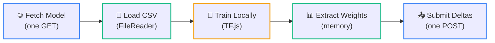

# Hospital Dashboard

The hospital dashboard is the heart of the federated learning client. Built with **Next.js App Router**, **TensorFlow.js**, **Tailwind CSS**, and **Framer Motion**, it provides a complete in-browser training environment where hospitals can participate in the federation without installing any software or exposing any data.

<Callout type="info" title="No Server-Side Training">
  Unlike traditional ML platforms that run training on cloud GPUs, this platform pushes all computation to the **browser**. TensorFlow.js leverages the hospital machine's **WebGL** (GPU) or **WASM** (CPU) backend. The central server never processes any training data.
</Callout>

---

## Training Pipeline Overview

The hospital dashboard implements a 5-stage pipeline, each running entirely on the client side:



Only the first and last stages involve network requests. Everything in between runs in the browser's JavaScript runtime.

---

## Stage 1: Model Synchronization

When a hospital enters the dashboard at `/hospital/[name]`, the first action is downloading the current global model state.

```typescript
// Fetch the global model weights from the central server
const response = await fetch(`${API_URL}/api/model/global/json`);
const globalWeights = await response.json();

// Build a TF.js sequential model matching the server's architecture
const model = tf.sequential();
model.add(tf.layers.dense({ units: 64, activation: 'relu', inputShape: [13] }));
model.add(tf.layers.dense({ units: 32, activation: 'relu' }));
model.add(tf.layers.dense({ units: 2, activation: 'softmax' }));

// Compile with categorical crossentropy for binary classification
model.compile({
  optimizer: tf.train.adam(0.001),
  loss: 'categoricalCrossentropy',
  metrics: ['accuracy'],
});

// Inject the global weights into the local model
const tensors = globalWeights.map((w: number[]) => tf.tensor(w));
model.setWeights(tensors);
```

<Callout type="warn" title="Architecture Must Match">
  The local TF.js model **must** mirror the exact layer structure defined by the PyTorch model on the server. If the server uses `[13 → 64 → 32 → 2]`, the client must create layers with the same dimensions. A mismatch will cause `model.setWeights()` to throw a shape error.
</Callout>

---

## Stage 2: Secure Data Loading

### The Zero-Knowledge Constraint

The data loading mechanism is designed around a single rule: **patient data never touches the network**.

The dashboard uses the browser's native `<input type="file" />` element paired with the **HTML5 FileReader API**. When a hospital selects a CSV file, the browser reads it directly from disk into JavaScript memory. No HTTP upload occurs.

```typescript
const handleFileUpload = (event: React.ChangeEvent<HTMLInputElement>) => {
  const file = event.target.files?.[0];
  if (!file) return;

  const reader = new FileReader();
  reader.onload = (e) => {
    const csvText = e.target?.result as string;
    const { features, labels } = parseCSV(csvText);
    // Data now exists only in browser RAM
  };
  reader.readAsText(file);
};
```

<Callout type="info" title="Verifiable Privacy">
  You can verify this claim yourself: open the browser's **Network tab** (DevTools → Network) before uploading a file. You will see **zero outgoing requests** during file selection and parsing. The `FileReader` API operates entirely within the browser's sandbox.
</Callout>

### CSV Parsing Pipeline

The raw CSV goes through several transformations before it becomes training data:

<Steps>
  <Step>
    ### Raw Text Ingestion

    The CSV is split by newlines and commas. The first row (headers) is discarded. Each subsequent row represents one patient.

    ```
    age,sex,cp,trestbps,chol,fbs,restecg,thalach,exang,oldpeak,slope,ca,thal,target
    63,1,3,145,233,1,0,150,0,2.3,0,0,1,1
    37,1,2,130,250,0,1,187,0,3.5,0,0,2,1
    ```
  </Step>

  <Step>
    ### Null Token Filtering

    The Cleveland dataset uses `?` as a null marker. Rows containing any `?` value are removed entirely to ensure clean training data:

    ```typescript
    const cleanRows = rows.filter(row =>
      row.every(cell => cell.trim() !== '?')
    );
    ```
  </Step>

  <Step>
    ### Feature-Label Separation

    The last column (`target`) is separated as the label. The remaining 13 columns become the feature vector:

    ```typescript
    const features = cleanRows.map(row =>
      row.slice(0, 13).map(Number)
    );
    const labels = cleanRows.map(row =>
      parseInt(row[13]) > 0 ? 1 : 0  // Binary: disease or no disease
    );
    ```
  </Step>

  <Step>
    ### Tensor Conversion

    The JavaScript arrays are converted into TensorFlow.js tensors for GPU-accelerated computation:

    ```typescript
    const featureTensor = tf.tensor2d(features);              // Shape: [N, 13]
    const labelTensor = tf.oneHot(tf.tensor1d(labels, 'int32'), 2);  // Shape: [N, 2]
    ```

    `tf.oneHot` converts binary labels `[0, 1, 1, 0]` into one-hot encoded vectors `[[1,0], [0,1], [0,1], [1,0]]` for categorical crossentropy training.
  </Step>
</Steps>

---

## Stage 3: In-Browser Training

This is where the computation happens. TensorFlow.js runs the full training loop inside the browser using the available hardware acceleration:

<Tabs items={["Training Execution", "Backend Selection", "Live Metrics"]}>
  <Tab value="Training Execution">
    ```typescript
    const history = await model.fit(featureTensor, labelTensor, {
      epochs: 50,
      batchSize: 32,
      validationSplit: 0.2,
      shuffle: true,
      callbacks: {
        onEpochEnd: (epoch, logs) => {
          console.log(
            `Epoch ${epoch + 1}: ` +
            `loss=${logs?.loss.toFixed(4)}, ` +
            `acc=${logs?.acc.toFixed(4)}, ` +
            `val_loss=${logs?.val_loss.toFixed(4)}, ` +
            `val_acc=${logs?.val_acc.toFixed(4)}`
          );
        }
      }
    });
    ```

    **Key parameters:**
    - `epochs: 50` — Number of complete passes over the local dataset
    - `batchSize: 32` — Samples processed before each gradient update
    - `validationSplit: 0.2` — 20% of data held out for validation metrics
    - `shuffle: true` — Randomizes sample order each epoch to reduce overfitting
  </Tab>

  <Tab value="Backend Selection">
    TensorFlow.js automatically selects the best available compute backend:

    | Backend | Hardware | Performance | Availability |
    |---------|----------|-------------|-------------|
    | **WebGL** | GPU | Fastest | Most modern browsers |
    | **WASM** | CPU (optimized) | Fast | Universal fallback |
    | **CPU** | CPU (JS) | Slowest | Always available |

    The backend is selected at runtime. No configuration is needed — TF.js probes the environment and picks the fastest option. For the current model size (~5K parameters), even the CPU backend trains in under 10 seconds.
  </Tab>

  <Tab value="Live Metrics">
    The `onEpochEnd` callback streams training metrics to the dashboard UI in real time. The dashboard renders:

    - **Loss curve** — Training and validation loss per epoch
    - **Accuracy curve** — Training and validation accuracy per epoch
    - **Progress bar** — Current epoch / total epochs
    - **Elapsed time** — Total training duration

    These metrics help the hospital operator verify that training is proceeding correctly before submitting weights. If the loss diverges or accuracy plateaus, they can adjust parameters and retrain.
  </Tab>
</Tabs>

---

## Stage 4: Weight Extraction

After `model.fit()` completes, the trained weights need to be extracted from the TF.js model and prepared for submission:

```typescript
// Extract all weight tensors from the trained model
const trainedWeights = model.getWeights();

// Convert from GPU tensors to plain JavaScript arrays
const weightArrays = trainedWeights.map(tensor => {
  const data = Array.from(tensor.dataSync());
  const shape = tensor.shape;
  return { data, shape };
});

// Clean up GPU memory
trainedWeights.forEach(t => t.dispose());
```

<Callout type="warn" title="Memory Management">
  TF.js tensors allocate GPU memory that is not managed by JavaScript's garbage collector. Always call `.dispose()` on tensors when you're done with them, or use `tf.tidy()` to automatically clean up intermediate tensors. Memory leaks in long-running browser sessions can crash the tab.
</Callout>

---

## Stage 5: Secure Submission

The final stage submits the trained weights to the central server. This is the **only outgoing network request** that carries training results:

```typescript
const response = await fetch(
  `${API_URL}/api/hospital/${hospitalName}/submit`,
  {
    method: 'POST',
    headers: { 'Content-Type': 'application/json' },
    body: JSON.stringify({
      weights: weightArrays,
      metrics: {
        accuracy: finalAccuracy,
        loss: finalLoss,
        samples: numberOfPatients,
      },
    }),
  }
);
```

### What is transmitted

| Field | Type | Contains Patient Data? |
|-------|------|----------------------|
| `weights` | `number[][]` | No — mathematical parameters only |
| `metrics.accuracy` | `number` | No — aggregate statistic |
| `metrics.loss` | `number` | No — aggregate statistic |
| `metrics.samples` | `number` | No — count only |

### What is NOT transmitted

| Data | Status |
|------|--------|
| Patient names or IDs | Never leaves browser |
| CSV file contents | Never leaves browser |
| Individual feature values | Never leaves browser |
| Diagnosis labels | Never leaves browser |
| File path or filename | Never leaves browser |

<Callout type="info" title="Post-Submission">
  After successful submission, the server may trigger a new FedAvg aggregation round if enough hospitals have contributed. The hospital can then fetch the improved global model and start a new training cycle, progressively building a model that benefits from all participating institutions.
</Callout>

---

## UI Architecture

The dashboard is built with a glassmorphism design language using Tailwind CSS and Framer Motion:

| Component | Technology | Purpose |
|-----------|-----------|---------|
| **Training Panel** | React + TF.js | Model compilation, training execution |
| **Metrics Dashboard** | Framer Motion | Animated loss/accuracy charts |
| **File Upload Zone** | HTML5 FileReader | Drag-and-drop CSV loading |
| **Status Indicators** | SWR + REST | Live federation sync status |
| **Theme Toggle** | next-themes | Light/dark mode switching |

The entire dashboard is a client component (`"use client"`) because TensorFlow.js requires browser APIs (`WebGL`, `FileReader`, `GPU`) that are unavailable during server-side rendering.
